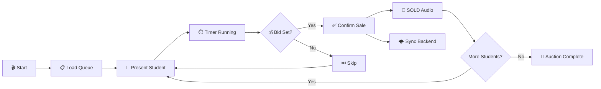

 <p align="center">
  
</p>

<h1 align="center">🏆 CodingGita Auction</h1>

<p align="center">
  <strong>Official Auction Arena</strong>
</p>

<p align="center">
  <em>A deterministic, real-time student auction platform built for live institutional events.</em>
</p>

<p align="center">
  
  
  
  
</p>

<p align="center">
  
  
</p>

---

## ✨ Features

<table>
<tr>
<td width="50%">

### 🎯 Core Capabilities
- ⚡ **Real-time Auction** — Live bidding with instant updates
- 🔒 **Deterministic Queue** — Seeded randomization, same order every time
- 💰 **Budget Tracking** — Live team spending and remaining credits
- 🎵 **Ceremonial Audio** — Context-aware sound cues for sales

</td>
<td width="50%">

### 🛡️ Live Event Safety
- 🔄 **Refresh-safe State** — LocalStorage persistence
- 📡 **Cross-tab Sync** — BroadcastChannel synchronization
- ⏱️ **Timer Precision** — Timestamp-based, drift-resistant
- 🎨 **Authority Design** — Black & gold institutional theme

</td>
</tr>
</table>

---

## 🖼️ Screenshots

<p align="center">
  <em>Main Auction Interface</em>
</p>

> 📸 *Screenshot placeholder — capture the live interface at `/auction`*

<p align="center">
  <em>Landing Ceremony</em>
</p>

> 📸 *Screenshot placeholder — capture the landing page at `/`*

---

## 🚀 Quick Start

### 1. Backend (Sync Engine)
```bash
cd backend
npm install
npm start
# 🚀 Server running on port 5000
```

### 2. Frontend (Auction Arena)
```bash
cd frontend
npm install
npm run dev
# ➜ Local: http://localhost:5173/
```

The auction interface will be available at **http://localhost:5173**

---

## 🏗️ System Architecture

```
┌─────────────────────────────────────────────────────────────┐
│                    CodingGita Auction                       │
├─────────────────────────────────────────────────────────────┤
│                                                             │
│  ┌─────────────┐    ┌─────────────┐    ┌─────────────┐      │
│  │   Landing   │───▶│   Auction   │───▶│    Admin    │      │
│  │   Ceremony  │    │    Stage    │    │   Portal    │      │
│  └─────────────┘    └─────────────┘    └─────────────┘      │
│                            │                                │
│                            ▼                                │
│  ┌──────────────────────────────────────────────────────┐   │
│  │              Authoritative State Store               │   │
│  │  • LocalStorage Persistence                          │   │
│  │  • BroadcastChannel Sync                             │   │
│  │  • Seeded PRNG Queue                                 │   │
│  └──────────────────────────────────────────────────────┘   │
│                            │                                │
│                            ▼ (Async)                        │
│                  ┌───────────────────┐                      │
│                  │   Backend (API)   │                      │
│                  └─────────┬─────────┘                      │
│                            │                                │
│             ┌──────────────┴──────────────┐                 │
│             ▼                             ▼                 │
│      MongoDB (Log)                Google Sheets (Live)      │
└─────────────────────────────────────────────────────────────┘
```

---

## 🎮 Auction Flow



---

## 🎨 Design System

<table>
<tr>
<td align="center" width="25%">
  <h3>🖤</h3>
  <strong>Deep Black</strong><br/>
  <code>#030308</code><br/>
  <em>Background</em>
</td>
<td align="center" width="25%">
  <h3>🟡</h3>
  <strong>Gold Authority</strong><br/>
  <code>#D4AF37</code><br/>
  <em>Accent</em>
</td>
<td align="center" width="25%">
  <h3>⚪</h3>
  <strong>Pure White</strong><br/>
  <code>#FFFFFF</code><br/>
  <em>Text</em>
</td>
<td align="center" width="25%">
  <h3>🌑</h3>
  <strong>Muted Gray</strong><br/>
  <code>rgba(255,255,255,0.4)</code><br/>
  <em>Secondary</em>
</td>
</tr>
</table>

### Motion Principles

| ❌ Forbidden | ✅ Allowed |
|-------------|-----------|
| Bounce effects | Opacity fades |
| Spring physics | Subtle scale |
| Elastic easing | Height expansion |
| Fast zooms | Blur-to-focus |
| Flashing | Staggered reveals |

---

## 🔊 Audio System

The platform uses **conditional audio routing** for ceremonial announcements:

| Event | Sound | Trigger |
|-------|-------|---------|
| 🎬 **Startup** | KBC Theme | Once on auction load |
| 💰 **Sale ≥15cr** | "Hacker Hai Bhai" | Price ≥ 15 crores |
| 7️⃣ **Sale = 7cr** | "7 Crore" Meme | Exactly 7 crores |
| ✅ **Default Sale** | KBC Theme | All other sales |

> 🔇 Only **one sound per event**. No overlapping. No race conditions.

---

## 👥 Team Structure (Vanguards)

Each **Vanguard** team operates with:

```
┌────────────────────────────────────┐
│         VANGUARD TEAM              │
├────────────────────────────────────┤
│  💰 Budget: 100 credits            │
│  📊 Spent: Live tracking           │
│  👥 Squad: Acquired students       │
│  🎨 Color: Team identity           │
│     • Terra (Emerald)              │
│     • Aqua  (Blue)                 │
│     • Aero  (Amber)                │
│     • Ignis (Rose)                 │
└────────────────────────────────────┘
```

---

## 🔐 Access Control

| Route | Access | Protection |
|-------|--------|------------|
| `/` | 🌐 Public | Landing ceremony |
| `/auction` | 🌐 Public | Main auction view |
| `/admin` | 🔒 Protected | Password required |

---

## 📦 Tech Stack

<table>
<tr>
<td align="center" width="20%">
  <br/>
  <strong>React 18</strong>
</td>
<td align="center" width="20%">
  <br/>
  <strong>TypeScript</strong>
</td>
<td align="center" width="20%">
  <br/>
  <strong>Vite</strong>
</td>
<td align="center" width="20%">
  <br/>
  <strong>Tailwind</strong>
</td>
<td align="center" width="20%">
  <br/>
  <strong>Framer</strong>
</td>
</tr>
</table>

### Backend Integration
*   **Express.js**: REST API for ingestion.
*   **MongoDB Atlas**: Persistent audit log.
*   **Google Sheets**: Real-time stakeholder view.

---

## ⚡ Performance Targets

| Metric | Target | Status |
|--------|--------|--------|
| First Contentful Paint | < 1s | ✅ |
| Time to Interactive | < 2s | ✅ |
| Build Time | < 15s | ✅ |
| Bundle Size | < 500KB | ✅ |
| Network Latency Impact | 0ms | ✅ (Optimistic UI) |

---

## 🛡️ Live Reliability Guarantees

- ✅ **No data loss** on page refresh (LocalStorage)
- ✅ **No race conditions** in state mutations (Atomic Context)
- ✅ **No audio overlap** during sales (Debounced Audio)
- ✅ **No accidental resets** without confirmation (Guarded Actions)
- ✅ **No queue drift** across sessions (Deterministic Seed)

---

## 📋 Operational Checklist (Pre-Event)

- [ ] **Infrastructure**: Verify Laptop -> Projector HDMI connection.
- [ ] **Data**: Reset Auction Database & Google Sheets.
- [ ] **Audio**: Test playback on venue speakers at volume.
- [ ] **Sync**: Open `localhost:5173` on two browser windows to test BroadcastChannel.
- [ ] **Backend**: Confirm `✅ Mongo Connected` and `✅ Sheet Ready` logs.

---

## 🤝 Credits

<p align="center">
  <strong>Built with precision for CodingGita</strong>
</p>

<p align="center">
  <em>"Correctness over convenience. Authority over spectacle. Reliability over novelty."</em>
</p>

---

<p align="center">
  
</p>

<p align="center">
  <strong>CodingGita Auction</strong><br/>
  <em>Official Auction Arena</em>
</p>

<p align="center">
  Made with 🖤 and ✨ for live institutional events
</p>
